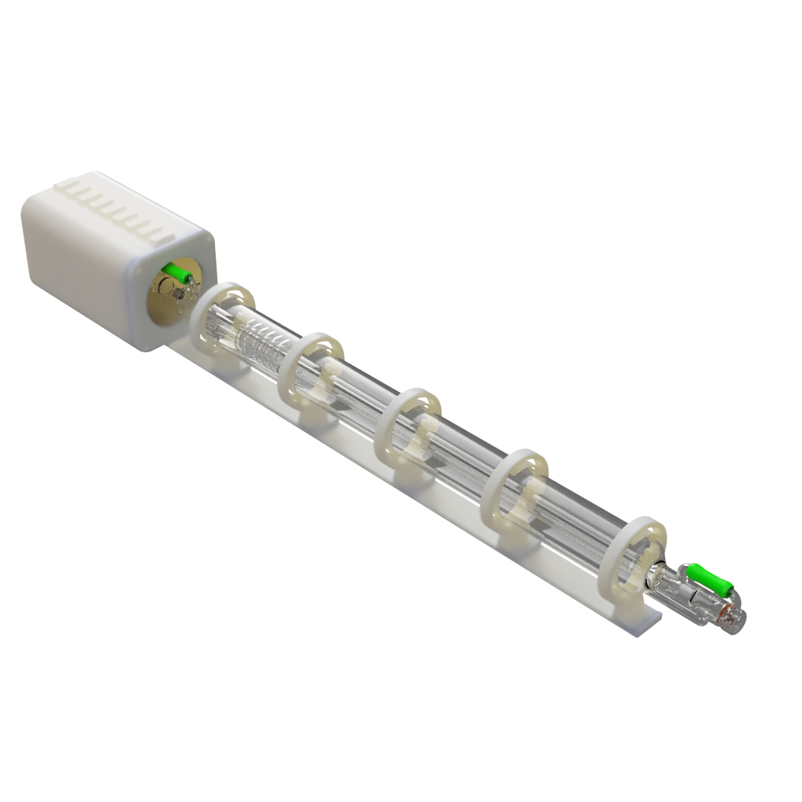
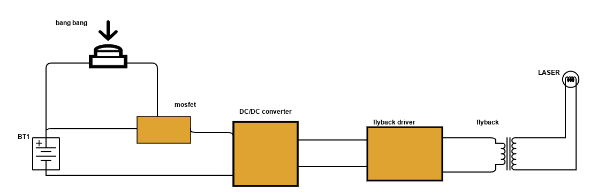

# High-Power Laser Tube Project

This repository contains the necessary files to build and understand a high-power laser tube, including STL files for 3D printing, CAD files for the full assembly, and a detailed schematic of the circuit. This project is designed for educational and experimental purposes only.

---

## Features

- **3D Model Files**: Includes STL and CAD files for all necessary components, ensuring compatibility with most 3D printers and CAD software.
- **Working Principle**:
  - A DC/DC converter steps up the input voltage to power the flyback transformer.
  - The flyback transformer generates the high voltage required for the laser tube.
  - A MOSFET is used to switch the power circuit, controlled by a simple push-button trigger.
  - The high-voltage arc excites the gas within the laser tube, producing a high-intensity beam of coherent light.
- **Schematic**: Contains a clear circuit diagram illustrating the electrical connections and components.

---

## Images

### Laser Tube Assembly

### Full Laser Setup

### Circuit Diagram

---

## Disclaimer

This project involves working with high-voltage electrical circuits and lasers, which can be extremely dangerous. **The authors of this project are not responsible for any harm, damage, or injury caused by the construction or use of this device.** By building or using this laser, you accept full responsibility for ensuring safety measures and compliance with local regulations.

---

## Files Included

- **STL Files**: Printable 3D models for the housing and structural components.
- **CAD Files**: Full assembly for detailed examination and modification.
- **Schematic**: Circuit diagram showing the electrical design of the system.
- **Bill of Materials (BOM)**: A detailed list of all components required for assembly.

---

## Important Notes

1. **Safety First**: Always use appropriate protective equipment, such as safety goggles rated for laser use, when operating this device.
2. **Legal Compliance**: Ensure that building and using this device complies with local laws and regulations regarding lasers and high-voltage equipment.
3. **Testing**: Test the device in a controlled environment, away from flammable materials and unprotected individuals.

